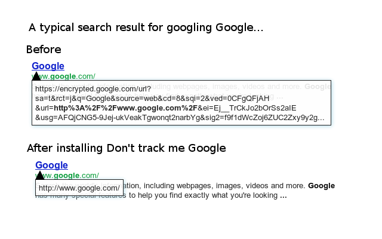

- Firefox: https://addons.mozilla.org/en-US/firefox/addon/dont-track-me-google1/ (Firefox on Android is also supported).
- Chrome: https://chrome.google.com/webstore/detail/dont-track-me-google/gdbofhhdmcladcmmfjolgndfkpobecpg

At the Google Search engine, search results are converted to an ugly link upon click. This link enables tracking for Google.

For example, the search entry

- `http://www.google.com/` (when searching for "Google") will be replaced with:
- `https://encrypted.google.com/url?sa=t&rct=j&q=Google&source=web&cd=8&sqi=2&ved=0CFgQFjAH&url=http%3A%2F%2Fwww.google.com%2F&ei=Ej__TrCkJo2bOrSs2aIE&usg=AFQjCNG5-9Jej-ukVeakTgwonqt2narbYg&sig2=f9f1dWcZoj6ZUC2Zxy9y2g`

This script removes Google's link-conversion/tracking feature.
This speeds up loading search results and allows you to right-click or tap to copy the link URL.

## History

- december 2011 - First release, as a [user script](https://web.archive.org/web/20140424090201/https://userscripts.org/scripts/show/121923).
- november 2012 - Published as a Chrome extension.
- april 2013 - Updated Chrome extension to disable `<a ping>`. This version worked fine for three years without any modifications.
- july 2016 - Published Firefox addon. Rewrote the program from scratch to recognize more URLs and to use modern techniques for a better performance.
  The goal is to prevent ugly URLs from appearing.
  Previous versions also included referrer hiding functionality, but that is not needed any more because all modern browsers support [referrer policies](https://blog.mozilla.org/security/2015/01/21/meta-referrer/).

Brought to you by Rob Wu (https://robwu.nl).
